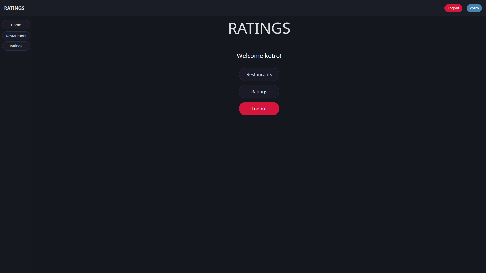
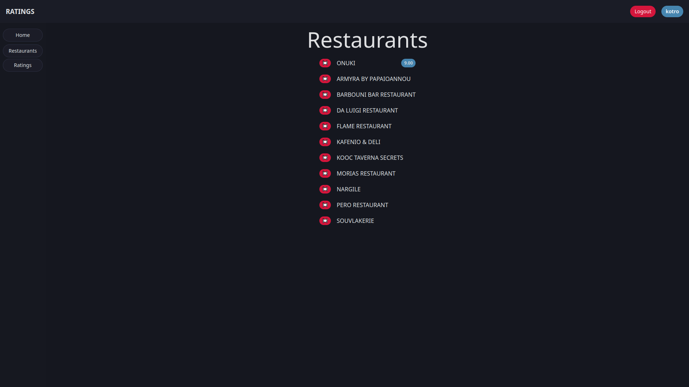
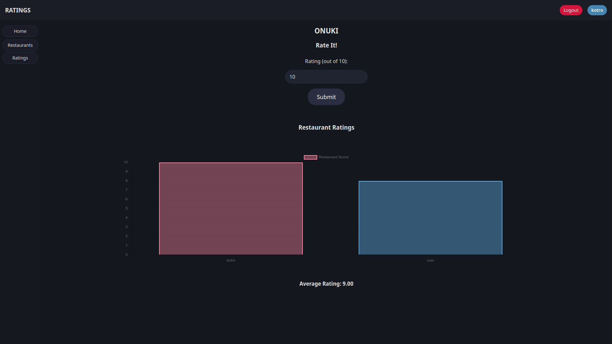
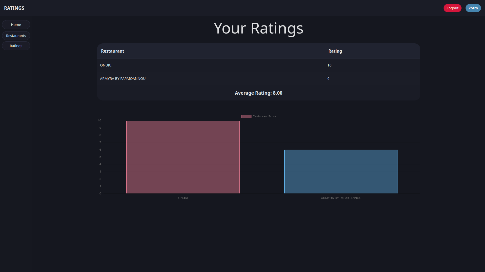

<!--  -->

# Ratings

`Ratings` is a backend web API written in [Rust](https://www.rust-lang.org/), built with [Actix Web](https://actix.rs/) and a frontend [SvelteKit](https://kit.svelte.dev/) site for rating restaurants.

| Home | Restaurants |
|--------------|--------------|
|  |  |

| Rate | Ratings |
|--------------|--------------|
|  |  |

## License

`Ratings` is licensed under the GNU GPLv3 license. See [LICENSE](LICENSE) for more information.
